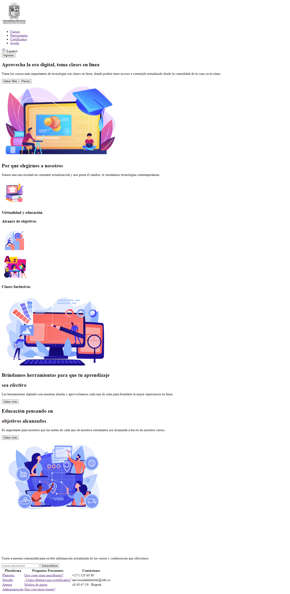
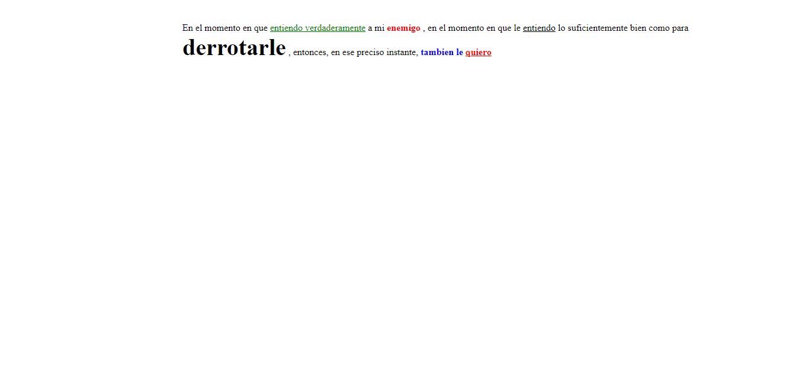
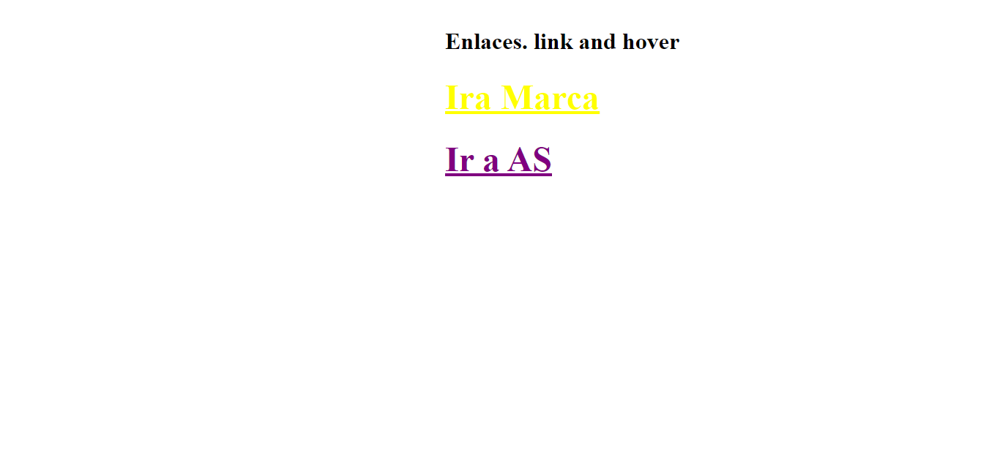
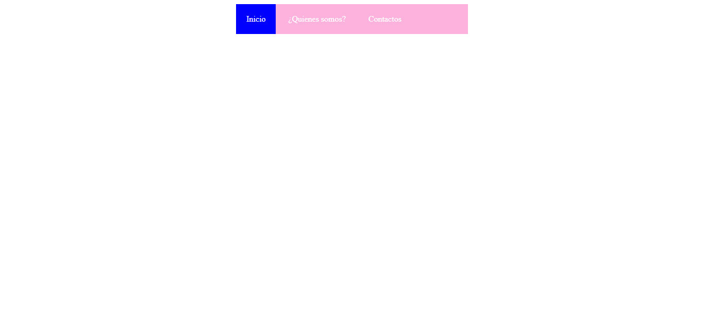

<h1>Taller 9 :Cristian Carpeta</h1>

<h2>Información</h2>

Curso: Full Stack Basico - Grupo 1

Profesor: Cristian Patiño

<h2>Punto 1: Link de figma</h2>
<a href="https://www.figma.com/file/tITyzhV9EvO7HdvX0CdeWE/CRISTIAN-ADRIAN-CARPETA?type=design&node-id=3-103&t=omFJKnQrbqioTaHw-0">Link de figma</a>

 
<a  href="https://cristian97carpeta.github.io/Taller-9-FULL-STACK/">Link pagina web</a>

 
<a href="https://cristian97carpeta.github.io/Taller-9-FULL-STACK/PUNTO-4/index.html">link punto 4</a>
 
 
<a href="https://cristian97carpeta.github.io/Taller-9-FULL-STACK/PUNTO-5/index.html">Link punto 5</a>

 
<a href="https://cristian97carpeta.github.io/Taller-9-FULL-STACK/PUNTO-6/index.html">Link punto 6</a>

 
<a href="https://cristian97carpeta.github.io/Taller-9-FULL-STACK/PUNTO-7-8/index.html">Link punto 7-8</a>

  
<h2>Punto 2: HTML</h2>

<h2>Punto 3: CSS</h2>

<h2>Punto 4:</h2>

<h2>Punto 5:</h2>

<h2>Punto 6:</h2>

<h2>Punto 7-8:</h2>

<h2>Punto 9:</h2>
<img src="./PUNTO-9/public/images/tabla-1.png"
alt="tabla-1"